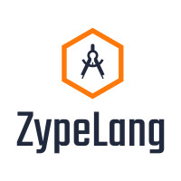

# ZypeLang - A OpenSource replacement for JSON

<p align='center'>
    
</p>

ZypeLang is a OpenSource replacement of JSON based on Python.

## Syntax

<div style="background-color: black;">
<a style="color: cyan">&lt;key&gt;</a> <a style="color: orange">"value"</a><a style="color: red;">;</a>
</div>

## How to use it

You can use ZypeLang with **Zype Python SDK**.

### Installation of ZypeSDK for Python

```shell
pip install ZypeSDK # Replace pip with pip3 and/or add sudo according to your Enviroment.
```

### Usage - ZypeSDK for Python

```python3
import ZypeLang as zype

name = zype.Open("file.zype")['name']

print(name)
```

### Usage ZypeLang
And in `file.zype`

<div style="background-color: black;">
<a style="color: cyan">&lt;name&gt;</a> <a style="color: orange">"Rajdeep Malakar"</a><a style="color: red;">;</a>
</div>

## Why to use

ZypeLang is easier & shorter than JSON

#### Example:

```json
{
    "name": "Rajdeep Malakar"
}
```

To,

<div style="background-color: black;">
<a style="color: cyan">&lt;name&gt;</a> <a style="color: orange">"Rajdeep Malakar"</a><a style="color: red;">;</a>
</div>